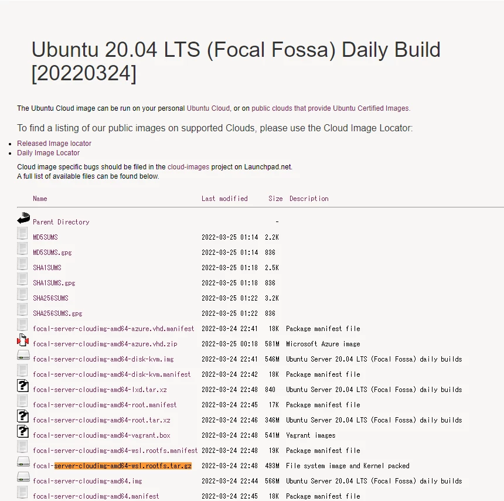
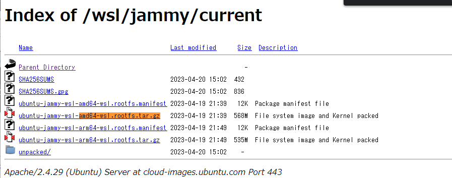

# Linux コンテナ のインストール

## 1. Ubuntu の インストール
### 1.1. rootfs の ダウンロード
#### 1.1.1. Ubuntu 20.04 LTS
[Ubuntu 20.04 LTS (Focal Fossa) daily](https://cloud-images.ubuntu.com/focal/current/) に移動して インストールするバージョンの Ubuntu のディレクトリに移動します。

rootfs（xxxxxx-server-cloudimg-amd64-wsl.rootfs.tar.gz）をダウンロードします。(xxxxxxは、バージョン）



### 1.1.2. Ubuntu Server 22.04 LTS以降
Ubuntu WSL Images  に移動して インストールするバージョンの Ubuntu のディレクトリに移動します。

rootfs（xxxxxx-server-cloudimg-amd64-wsl.rootfs.tar.gz）をダウンロードします。(xxxxxxは、バージョン）




### 1.2. rootfs の WSL へのインストール（登録）
通常 WSL パッケージは 「C:\Users\[ユーザー名]\AppData\Local\Packages\」以下にインストール（登録）されます。

今回、自由に パッケージ を登録したいので別のディレクトリにインストール（登録）を行います。

コマンドは以下となります。
```PowerShell
wsl --import <表示名> <インストール場所> <rootfsパス> --version 2
```
例として 「Ubuntu Server 20.04」 のインストール（登録）を行います。
```PowerShell
wsl --import Ubuntu20.04 V:\WSL\Package\Ubuntu20.04 G:\Download\focal-server-cloudimg-amd64-wsl.rootfs.tar.gz --version 2
```


## 2. WSLコマンドの使い方
**インストールされている Linux ディストリビューションを一覧表示する**
```PowerShell
wsl --list --verbose
```

**WSL バージョンを 1 または 2 に設定する**
```PowerShell
wsl --set-version <distribution name> <versionNumber>
```

**既定の WSL バージョンを設定する**
```PowerShell
wsl --set-default-version <Version>
```

**既定の Linux ディストリビューションを設定する**
```PowerShell
wsl --set-default <Distribution Name>
```
**アンインストール（登録削除）**
アンインストール（登録削除）は以下のコマンドとなります。
```PowerShell
wsl --unregister <表示名>
```
アンインストール（登録削除）を行うと、保存先のデータがすべて削除されてしまうので注意が必要です。

**WSL パッケージの書き出し**
WSLパッケージの書き出しは以下のコマンドとなります。
```PowerShell
wsl --export <表示名> <書き出しパス>
```

## 3. WSLの設定
### 3.1. ubuntuのユーザ作成
```bash
$ adduser hogeuser
$ usermod -aG sudo hogeuser
```
hogeuserを作成したいユーザ名にしてください。

### 3.2. WSLの起動時ログインユーザの指定
/etc/wsl.conf というファイルを作って、以下の内容で保存します。
```bash
$ sudo nano /etc/wsl.conf
[user]
default=hogeuser
```
hogeuserを作成したユーザ名にしてください。

### 3.3. resolv.confの問題対応
/etc/resolv.confが上書きされ、名前解決ができなくなる問題が発生するときがあります。
その場合、/etc/wsl.confに以下を追記します。
```bash
$ sudo nano /etc/wsl.conf
[network]
generateResolvConf = false
```
/etc/resolv.confを記述します。

```bash
$ sudo nano /etc/resolv.conf
nameserver 8.8.8.8
```

wslを再起動した場合に、/etc/resolv.confが消える場合は、上記処理に追加して以下を行います。

```bash
$ sudo chattr +i /etc/resolv.conf
```

