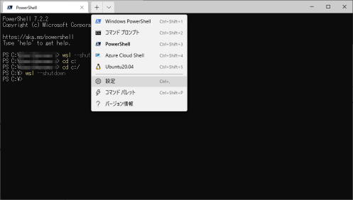
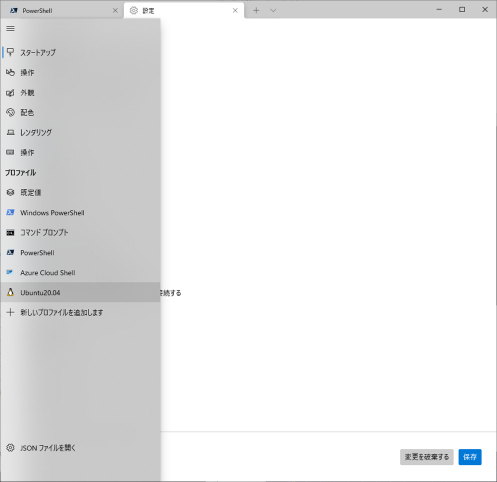
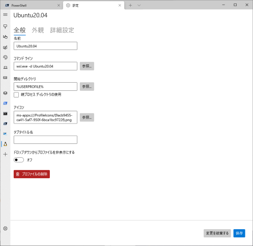
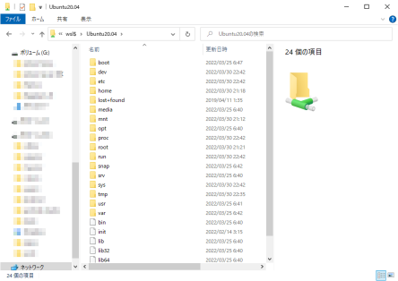

# WSL上のUbuntuの初期設定

## 1. ユーザ作成
WSL の Linux に入り以下のコマンドを入力します。
```bash
root@LAPTOP-SSBI3BQM:~# adduser hogeuser
Adding user `hogeuser' ...
Adding new group `hogeuser' (1000) ...
Adding new user `hogeuser' (1000) with group `hogeuser' ...
Creating home directory `/home/hogeuser' ...
Copying files from `/etc/skel' ...
New password:
Retype new password:
passwd: password updated successfully
Changing the user information for hogeuser
Enter the new value, or press ENTER for the default
        Full Name []:
        Room Number []:
        Work Phone []:
        Home Phone []:
        Other []:
Is the information correct? [Y/n] y
root@LAPTOP-SSBI3BQM:~# usermod -aG sudo hogeuser
root@LAPTOP-SSBI3BQM:~#
```
hogeuserを作成したいユーザ名に変更してください。

## 2. 作業ユーザの設定
WSL起動時にログイン状態となるユーザを設定します。
/etc/wsl.conf というファイルを作って、以下の内容で保存します。
```bash
root@LAPTOP-SSBI3BQM:~# cat << EOF > /etc/wsl.conf
[user]
default=hogeuser
EOF
root@LAPTOP-SSBI3BQM:~#
```
hogeuserを作成したユーザ名に変更してください。
WSL の Linux を終了し、powershell で WSL を終了させます。
```PowerShell
PS C:\> wsl --shutdown
PS C:\>
```
再度、WSL の Linux に入ると ログインユーザが設定したものに変更されています。

## 3. 開始ディレクトリの変更
Windows Terminal の設定開く。


左にある≣をクリックすると 各環境の設定が開く。


開始ディレクトリを変更する環境を選択する。


## 4. Windowsからファイルアクセスする
エクスプローラーに「\\wsl$\登録名\」を入力する

