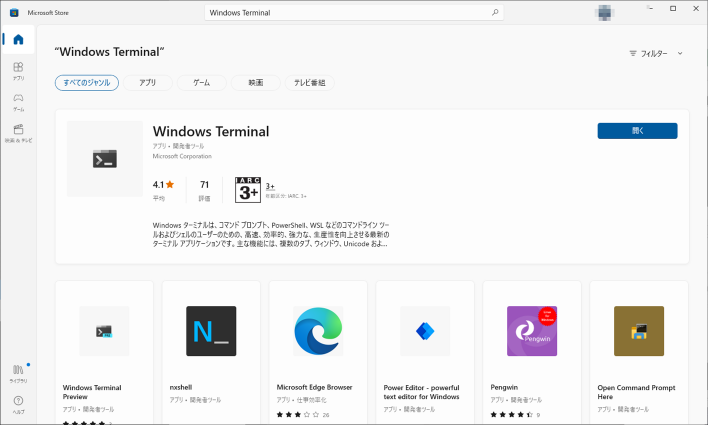
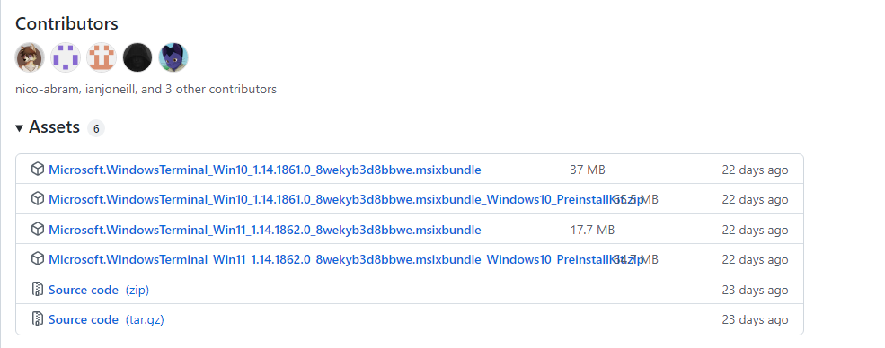
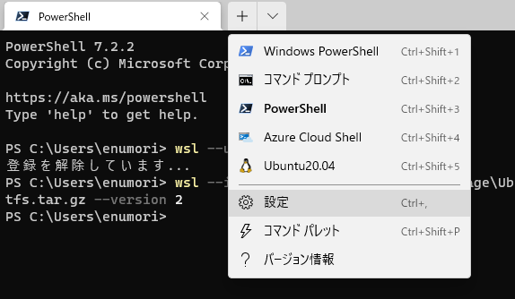
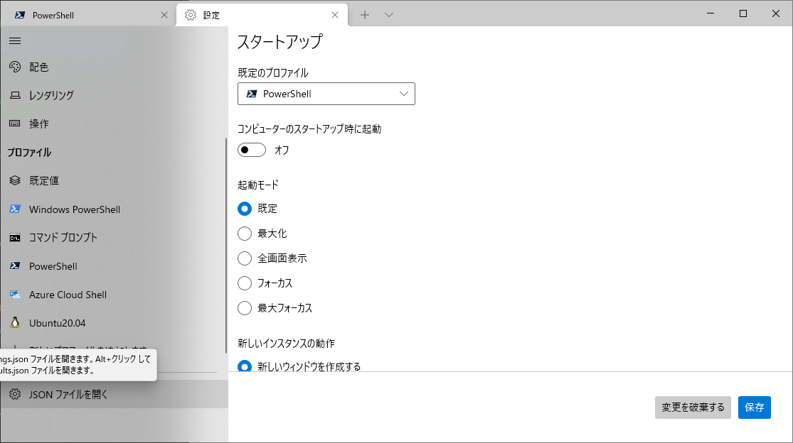
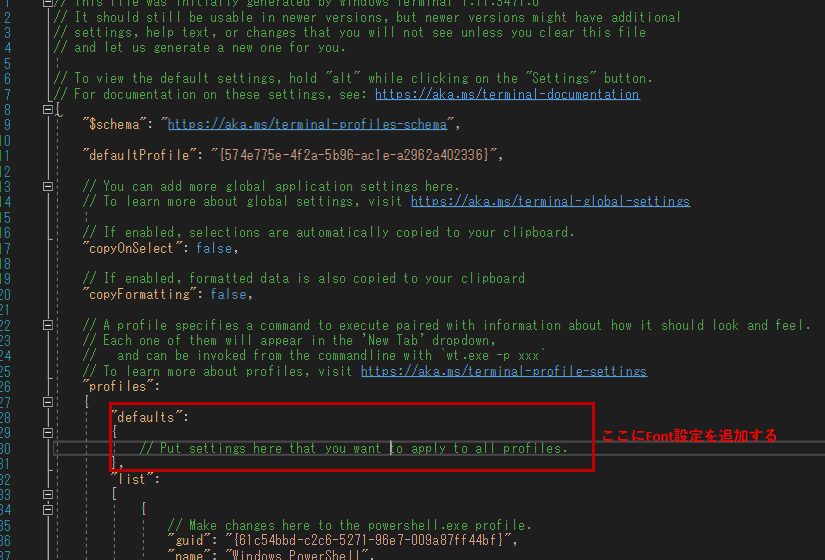

# Windows Terminal
WSLを使う場合は、Windows Terminalを使うと便利です。
そのため、Windows Terminal のインストールを行います。

## 1. Windows Terminal のインストール

### 1.1. Microsoft Storeからインストール
Microsoft Store の 検索に 「Windows Terminal」と入力します。



Windows Terminal をインストールします。

### 1.2. GitHubからインストール
**Microsoft Terminal の GitHibサイトにアクセスする。**
[Releases microsoft/terminal](https://github.com/microsoft/terminal/releases)

**WindowsTerminalのダウンロード**
Asset セクションから Microsoft.WindowsTerminal_<versionNumber>.msixbundle をダウンロードする。


ダウンロードしたファイルをダブルクリックしてインストールを行います。

### 1.3. wingetでインストール
PowerShell、コマンドプロンプトに以下を入力しインストールを行う。
```PowerShell
winget install --id=Microsoft.WindowsTerminal -e
```
以下のコマンドを入力してWindow Terminalを起動します。
```PowerShell
wt
```

## 2. Windows Terminal の設定
Windows Terminal の 設定を行います。

**Windows Terminal を起動して 設定画面を開きます。**


**【JSON ファイルを開く】を選択してます。**


**"profiles” の ”defaults” にフォント設定を追加します。**


```
"profiles":
    {
        "defaults":
        {
        　　// Put settings here that you want to apply to all profiles.
            "font":
            {
                "face": "\uff2d\uff33 \u30b4\u30b7\u30c3\u30af"
            }
        },
        "list":
        [
```