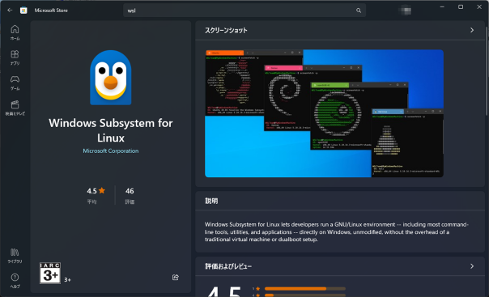
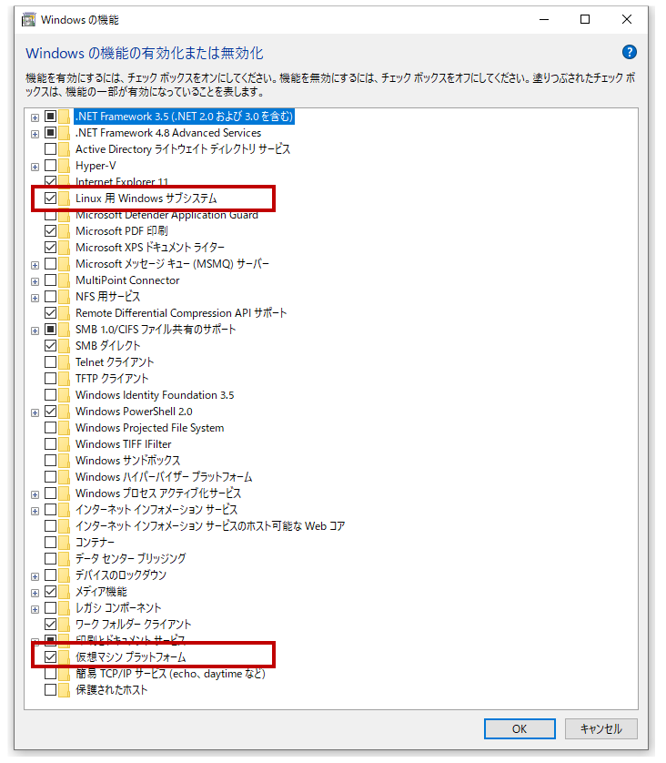

# インストール

## WSLのインストール
Microsoft StoreでWSLを検索してインストールを行います。


### WSL を Version 2 に設定
```PowerShell
wsl --set-default-version 2
```


## 以前のWSLのインストール
### WSLを使用するのに必要な機能の有効化
**1. 「Linux 用 Windows サブシステム」を有効にする**

Windows PowerShell（管理者）を立ち上げ以下のコマンドを入力します。
```PowerShell
dism.exe /online /enable-feature /featurename:Microsoft-Windows-Subsystem-Linux /all /norestart
```
**2. 「仮想マシン プラットフォーム」を有効にする**
```PowerShell
dism.exe /online /enable-feature /featurename:VirtualMachinePlatform /all /norestart
```

なお上記の二つの機能の有効化は、
Windows システムツールの【コントロール パネル】から【プログラム】→【Windowsの機能の有効化または無効化】で下図の項目にチェックを入れることでも可能です。



### Linux カーネル更新プログラム パッケージのインストール
[x64 マシン用 WSL2 Linux カーネル更新プログラム パッケージ](https://wslstorestorage.blob.core.windows.net/wslblob/wsl_update_x64.msi) をダウンロードしてインストールします。

### WSL を Version 2 に設定
```PowerShell
wsl --set-default-version 2
```

